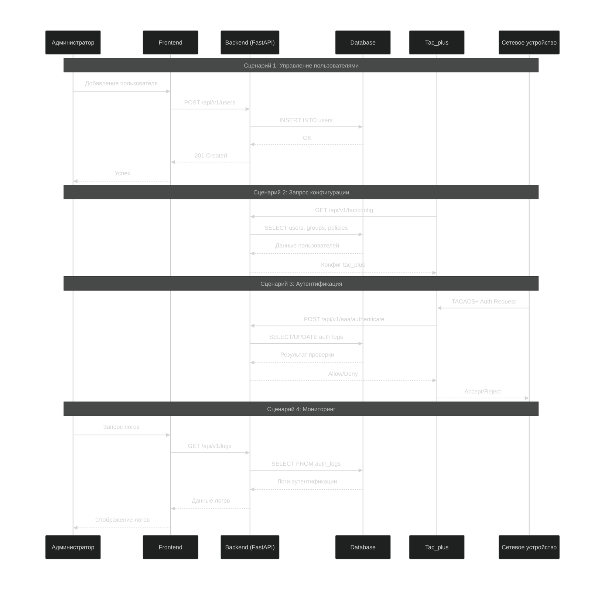

## Архитектура проекта

### Общая схема системы


### Взаимодействие модулей


## Структура проекта в виде диаграммы
 

## Запуск через reverse proxy (HTTPS 443)

Для доступа с других компьютеров без ребилда фронтенда используется [`docker/docker-compose.yml`](docker/docker-compose.yml).

- Внешняя точка входа: `https://<SERVER_IP>/`
- UI проксируется на [`tacacs-frontend:3000`](docker/docker-compose.yml)
- API проксируется по пути `https://<SERVER_IP>/api/*` на [`tacacs-api:8000`](docker/docker-compose.yml)

Ключевые файлы:

- [`docker/nginx/default.conf`](docker/nginx/default.conf) — правила reverse proxy (`/` и `/api/`) + TLS
- [`frontend/src/lib/api/client.ts`](frontend/src/lib/api/client.ts:24) — базовый URL API по умолчанию `"/api"`
- [`docker/nginx/certs/tls.pem`](docker/nginx/certs/tls.pem) — корпоративный PEM (сертификат + приватный ключ)

### Как запустить

1. Поднять стек:

```bash
docker compose -f docker/docker-compose.yml up -d --build
```

2. Подготовить сертификат:

- положить PEM-файл в [`docker/nginx/certs/tls.pem`](docker/nginx/certs/tls.pem)
- PEM должен содержать и `BEGIN CERTIFICATE`, и `BEGIN PRIVATE KEY`

3. Открыть с клиентского ПК:

- `https://<SERVER_IP>/`

4. Проверить в DevTools, что запросы идут на относительный путь `/api/...`.

### Примечание

При смене IP/домена сервера ребилд фронтенда не требуется: браузер обращается к тому же origin, а маршрутизация в API выполняется proxy.

## Tacacs reloader (авто-рестарт tac_plus-ng при изменении конфига)

В стек добавлен сервис [`tacacs-reloader`](docker/docker-compose.yml), который:

- следит за файлами в общем томе `/etc/tac_plus-ng`
- вычисляет fingerprint по файлам `users,user_groups,devices,profiles,ruleset`
- при изменении вызывает Docker Engine API и перезапускает контейнер [`tacacs_plus`](docker/docker-compose.yml)

Файлы reloader:

- [`docker/reloader/reloader.py`](docker/reloader/reloader.py)
- [`docker/reloader/Dockerfile`](docker/reloader/Dockerfile)
- [`docker/reloader/requirements.txt`](docker/reloader/requirements.txt)

Основные переменные окружения reloader (в [`docker/docker-compose.yml`](docker/docker-compose.yml)):

- `WATCH_DIR` — директория с сгенерированными TACACS-файлами
- `TARGET_CONTAINER` — контейнер для рестарта (по умолчанию `tacacs_plus`)
- `POLL_INTERVAL` — интервал опроса (сек)
- `RESTART_TIMEOUT` — timeout рестарта контейнера
- `RELOADER_FILES` — список отслеживаемых файлов через запятую

### Перезапуск стека

```bash
docker compose -f docker/docker-compose.yml up -d --build
```

После этого кнопка `APPLY` в UI запускает генерацию файлов, а reloader автоматически рестартует `tac_plus-ng`, если fingerprint изменился.

## Изменение модели групп пользователей

- Раздел `User Groups` удалён из UI и API.
- Назначение групп пользователю выполняется из `Device Groups` в карточке пользователя.
- Таблица `user_group_members` использует `group_id` из `device_groups`.
- Суффиксы прав доступа в генерации сохранены: `_ro` и `_rw`.
