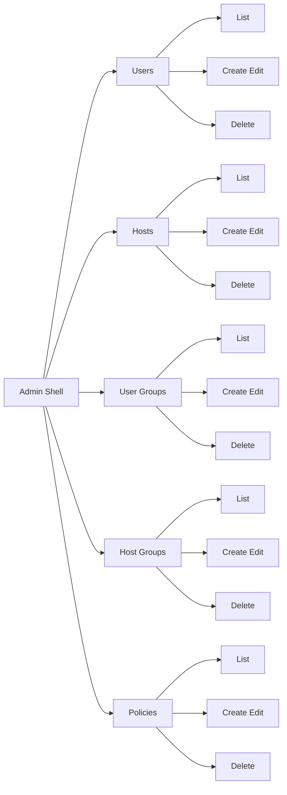

# TACACS React Admin Plan

## 1) Goal
Build a separate frontend in [`frontend`](frontend) using Next.js + TypeScript + Tailwind for full CRUD management of:
- Users
- Hosts
- User Groups
- Host Groups
- Policies

Backend remains API-only in [`docker/api/app/main.py`](docker/api/app/main.py).

## 2) Confirmed constraints and decisions
- Frontend is separate from backend service.
- Full CRUD is required for all five sections above.
- Preferred stack: Next.js + TypeScript + Tailwind.
- Existing API endpoints from [`docker/api/app/main.py`](docker/api/app/main.py) are source of truth.

## 3) Proposed architecture
### Frontend app structure
- [`frontend/package.json`](frontend/package.json)
- [`frontend/next.config.ts`](frontend/next.config.ts)
- [`frontend/tsconfig.json`](frontend/tsconfig.json)
- [`frontend/app/layout.tsx`](frontend/app/layout.tsx)
- [`frontend/app/page.tsx`](frontend/app/page.tsx)
- [`frontend/app/globals.css`](frontend/app/globals.css)
- [`frontend/app/admin/page.tsx`](frontend/app/admin/page.tsx)
- [`frontend/src/lib/api/client.ts`](frontend/src/lib/api/client.ts)
- [`frontend/src/lib/api/endpoints.ts`](frontend/src/lib/api/endpoints.ts)
- [`frontend/src/lib/types/tacacs.ts`](frontend/src/lib/types/tacacs.ts)
- [`frontend/src/components/layout/sidebar.tsx`](frontend/src/components/layout/sidebar.tsx)
- [`frontend/src/components/common/data-table.tsx`](frontend/src/components/common/data-table.tsx)
- [`frontend/src/components/common/entity-modal.tsx`](frontend/src/components/common/entity-modal.tsx)
- [`frontend/src/components/common/confirm-delete.tsx`](frontend/src/components/common/confirm-delete.tsx)
- [`frontend/src/components/common/alert.tsx`](frontend/src/components/common/alert.tsx)
- [`frontend/src/features/users/users-panel.tsx`](frontend/src/features/users/users-panel.tsx)
- [`frontend/src/features/hosts/hosts-panel.tsx`](frontend/src/features/hosts/hosts-panel.tsx)
- [`frontend/src/features/user-groups/user-groups-panel.tsx`](frontend/src/features/user-groups/user-groups-panel.tsx)
- [`frontend/src/features/host-groups/host-groups-panel.tsx`](frontend/src/features/host-groups/host-groups-panel.tsx)
- [`frontend/src/features/policies/policies-panel.tsx`](frontend/src/features/policies/policies-panel.tsx)

### Runtime config
- Use public env variable [`NEXT_PUBLIC_API_BASE_URL`](frontend/.env.example).
- Example value: `http://localhost:8000`.

## 4) UI information architecture
- Single admin screen at [`/admin`](frontend/app/admin/page.tsx).
- Left sidebar navigation with five sections.
- Right content area with:
  - section title and actions
  - list table
  - create and edit modal
  - delete confirmation modal

## 5) API mapping for CRUD
Source: [`docker/api/app/main.py`](docker/api/app/main.py).

### Users
- List: `GET /users`
- Create: `POST /users`
- Read one: `GET /users/{username}`
- Update: `PUT /users/{username}`
- Delete: `DELETE /users/{username}`

### Hosts
- List: `GET /hosts`
- Create: `POST /hosts`
- Read one: `GET /hosts/{ip_address}`
- Update: `PUT /hosts/{ip_address}`
- Delete: `DELETE /hosts/{ip_address}`

### User Groups
- List: `GET /user-groups`
- Create: `POST /user-groups`
- Read one: `GET /user-groups/{group_name}`
- Update: `PUT /user-groups/{group_name}`
- Delete: `DELETE /user-groups/{group_name}`

### Host Groups
- List: `GET /host-groups`
- Create: `POST /host-groups`
- Read one: `GET /host-groups/{group_name}`
- Update: `PUT /host-groups/{group_name}`
- Delete: `DELETE /host-groups/{group_name}`

### Policies
- List: `GET /policies`
- Create: `POST /policies`
- Read one: `GET /policies/{policy_id}`
- Delete: `DELETE /policies/{policy_id}`

Note: dedicated `PUT /policies/{policy_id}` does not exist in [`main.py`](docker/api/app/main.py). For policy update UX, use delete-and-recreate workflow or add backend endpoint later.

## 6) Form model and validation
### Users form
- Required: `username`, `password` on create
- Optional: `full_name`
- Boolean: `is_active`
- Update: password optional

### Hosts form
- Required: `ip_address`, `tacacs_key`
- Optional: `hostname`, `description`
- Update keeps existing values if optional fields are unchanged

### User Groups form
- Required: `group_name`
- Optional: `description`

### Host Groups form
- Required: `group_name`
- Optional: `description`

### Policies form
- Required: `user_group_name`, `host_group_name`
- Required numeric range: `priv_lvl` 0..15
- Boolean: `allow_access`

Validation strategy:
- Client-side validation before request.
- Backend message passthrough from API `detail` field.
- Inline field errors and top-level error alert.

## 7) Data and state strategy
- For each panel:
  - load list on mount
  - create and edit submit then refresh list
  - delete submit then refresh list
- Keep local UI state per panel:
  - `items`, `loading`, `error`, modal state, selected item
- Implement shared fetch helper in [`client.ts`](frontend/src/lib/api/client.ts):
  - inject base URL
  - normalize non-2xx API errors
  - parse JSON envelope

## 8) Reusable component plan
- `SidebarNav` for section switching
- `SectionHeader` for title and create button
- `DataTable` generic table shell
- `EntityModal` generic modal wrapper with form body slot
- `ConfirmDeleteDialog` for irreversible actions
- `InlineAlert` for API errors and warnings
- `LoadingState` for progress and skeletons

## 9) Docker and integration plan
- Add new frontend service in [`docker/docker-compose.yml`](docker/docker-compose.yml):
  - build context `./frontend`
  - expose port `3000`
  - env `NEXT_PUBLIC_API_BASE_URL=http://localhost:8000`
  - depends on `tacacs-api`
- Keep backend CORS open as currently configured in [`main.py`](docker/api/app/main.py:17).

## 10) Implementation sequence for Code mode
1. Scaffold Next.js TypeScript app in [`frontend`](frontend).
2. Add Tailwind and global styles.
3. Implement API client and type models.
4. Build admin shell and sidebar navigation.
5. Implement Users panel with full CRUD.
6. Implement Hosts panel with full CRUD.
7. Implement User Groups panel with full CRUD.
8. Implement Host Groups panel with full CRUD.
9. Implement Policies panel with list, create, delete and update UX fallback.
10. Add shared error and loading states.
11. Wire Docker compose for frontend service.
12. Execute manual end-to-end verification.

## 11) Verification checklist
- Users CRUD works from UI and persists in DB.
- Hosts CRUD works from UI and persists in DB.
- User Groups CRUD works from UI and persists in DB.
- Host Groups CRUD works from UI and persists in DB.
- Policies create, list, delete work; update workflow is explicit and predictable.
- API failures show readable errors.
- Invalid inputs are blocked client-side.
- Layout is responsive and usable on desktop and laptop widths.
- No console errors for normal CRUD flows.

## 12) Context7 basis used for plan
- Next.js docs: [`/vercel/next.js`](https://context7.com/vercel/next.js)
  - App Router data fetching and env variable handling patterns.
- Tailwind docs: [`/websites/v3_tailwindcss`](https://context7.com/websites/v3_tailwindcss)
  - Responsive mobile-first layout and focus/accessibility utility patterns.
